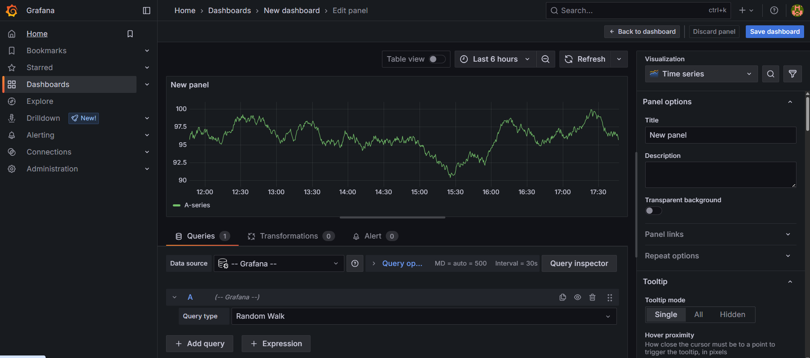

# Roteiro 6 — Bottlenecks: Caching e Observabilidade

## Desenvolvedora

- Esther Cunha

---

## ✅ O que são Bottlenecks?

Bottlenecks (gargalos) são pontos do sistema que causam lentidão, consumo excessivo de recursos ou atrasos na resposta. Para mitigar esses problemas, é fundamental adotar técnicas que aumentem a performance e melhorem a visibilidade da aplicação.

Neste projeto, foram implementadas duas soluções:

- **Caching com Redis**: para reduzir o número de chamadas ao banco de dados e melhorar o tempo de resposta.
- **Observabilidade com Prometheus e Grafana**: para monitorar métricas em tempo real da aplicação.

---

## 1. Caching com Redis

### O que é Caching?

Caching é o processo de armazenar dados temporariamente para que futuras requisições sejam atendidas mais rapidamente. Ao invés de buscar dados no banco todas as vezes, o sistema recupera diretamente do cache.

### Como foi implementado?

- Utilizado o **Spring Cache** com Redis como provedor.
- Redis foi configurado como um container no cluster Kubernetes.
- Anotações `@Cacheable` foram utilizadas em métodos de consulta, como por exemplo `getById`.

### Dependências no `pom.xml`

```xml
<dependency>
    <groupId>org.springframework.boot</groupId>
    <artifactId>spring-boot-starter-data-redis</artifactId>
</dependency>

<dependency>
    <groupId>org.springframework.boot</groupId>
    <artifactId>spring-boot-starter-cache</artifactId>
</dependency>
```

### Configuração no `application.yml`

```yaml
spring:
  cache:
    type: redis
  data:
    redis:
      host: ${REDIS_HOST:redis}
      port: ${REDIS_PORT:6379}
```
---

## 2. Observabilidade com Prometheus e Grafana

### O que é Observabilidade?

Observabilidade é a capacidade de entender o que está acontecendo no sistema através da coleta, visualização e análise de métricas e logs. Ela é essencial para diagnosticar falhas, analisar performance e acompanhar o uso da aplicação em tempo real.

### Como foi implementado?

- O endpoint `/actuator/prometheus` foi exposto com Spring Boot Actuator.
- As métricas são capturadas com **Micrometer + Prometheus**.
- Os dados são visualizados em tempo real no **Grafana**.

### Dependências no `pom.xml`

```xml
<dependency>
    <groupId>org.springframework.boot</groupId>
    <artifactId>spring-boot-starter-actuator</artifactId>
</dependency>

<dependency>
    <groupId>io.micrometer</groupId>
    <artifactId>micrometer-registry-prometheus</artifactId>
    <scope>runtime</scope>
</dependency>
```

### Configuração no `application.yml`

```yaml
management:
  endpoint:
    gateway:
      enabled: true
  endpoints:
    web:
      base-path: /gateway/actuator
      exposure:
        include: [ 'prometheus', 'gateway' ]
```

### Exemplo de Dashboard no Grafana




---

## Conclusão

As otimizações implementadas com Redis e Prometheus/Grafana proporcionam:

- **Maior performance e escalabilidade** com o uso de cache.
- **Maior controle e monitoramento** com a exposição de métricas e dashboards visuais.
- Suporte a práticas modernas de engenharia de software em ambientes distribuídos.

Essas soluções são fundamentais para garantir uma aplicação resiliente, performática e observável.

---