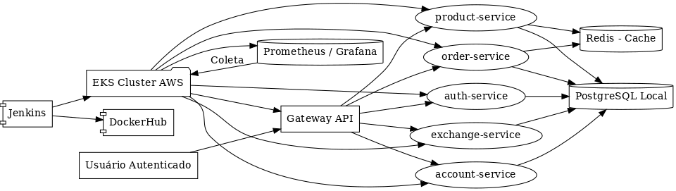
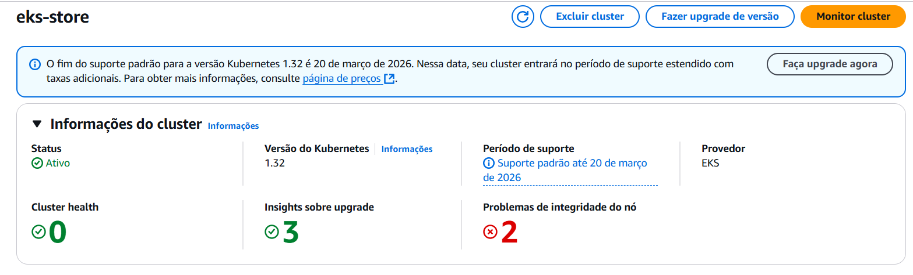
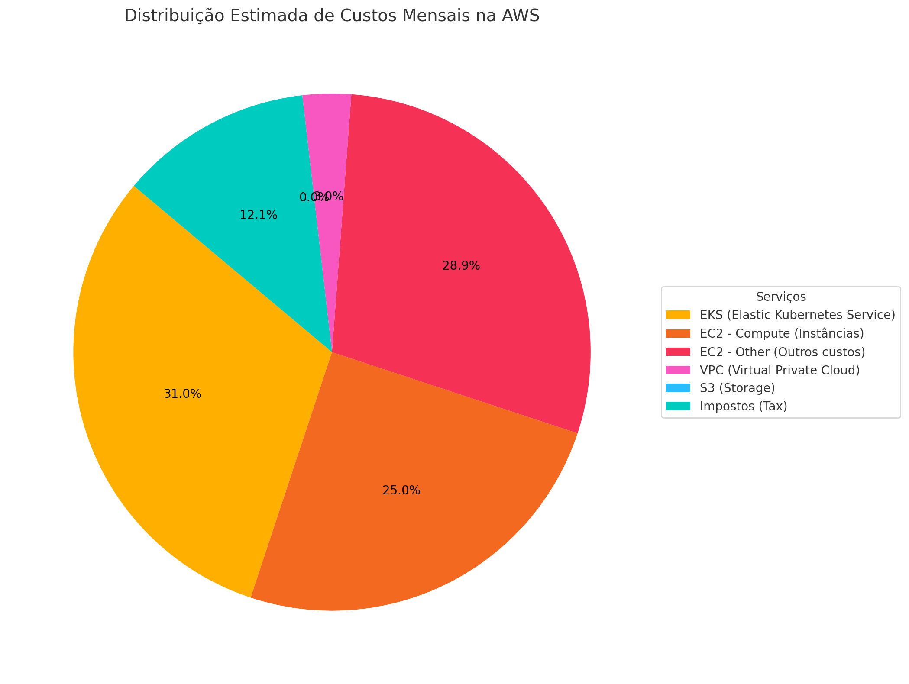

# 🌐 Projeto Final — Plataforma de Pedidos (Microserviços)

## Desenvolvedoras
- Esther Caroline  
- Ana Helena Caiafa

---

## Visão Geral

Este projeto consiste no desenvolvimento e implantação de uma **plataforma baseada em microsserviços** com **observabilidade, escalabilidade e automação de entrega contínua**, utilizando tecnologias como:

- Spring Boot (Java)
- Docker
- Jenkins
- Kubernetes (AWS EKS)
- Redis (caching)
- Prometheus + Grafana (observabilidade)

---

## Funcionalidades da Aplicação

- Cadastro e autenticação de usuários (Auth, Account)
- Consulta e gerenciamento de produtos (Product)
- Criação e processamento de pedidos (Order)
- API Gateway com roteamento centralizado
- Monitoramento e escalabilidade horizontal (HPA)

---

## Arquitetura da Solução

---

## CI/CD com Jenkins

Integramos o Jenkins ao ciclo de desenvolvimento para garantir entrega contínua:

- Build da aplicação com Maven
- Geração de imagens Docker multiplataforma
- Push automatizado no DockerHub
- Deploy no cluster Kubernetes (EKS)

---

## Kubernetes com EKS

A aplicação foi implantada em um cluster **EKS (Elastic Kubernetes Service)**, com os seguintes recursos para cada microserviço:

- `Deployment`
- `Service`
- `Secrets`
- `ConfigMap`

### 📸 Cluster EKS Ativo

---

## ☁️ Plataforma como Serviço (PaaS)

Utilizamos PaaS em dois principais pontos:

- **EKS:** gerenciamento de orquestração dos microsserviços
- **Jenkins em Kubernetes:** automatização do deploy desacoplado de infraestrutura

[Veja o roteiro completo de PaaS](paas.md)

---

## 💸 Análise de Custos

Analisamos os custos estimados com base nos serviços utilizados (EKS, EC2, Redis, etc.):

| Serviço                        | Estimativa Mensal |
|-------------------------------|-------------------|
| EKS + EC2 + VPC + Redis       | ≈ $40,79          |

### 📸 Gráfico de Custos

[Veja a análise de custos completa](custos.md)

---

## Bottlenecks e Soluções

### 1. Caching com Redis

- Redis foi integrado ao serviço de pedidos para reduzir consultas repetidas ao banco
- Utilizamos `@Cacheable` e `@CacheEvict` com Spring Cache
- Configurado para rodar via container no EKS

---

### 2. Observabilidade com Prometheus + Grafana

- Métricas coletadas via Actuator (`/actuator/prometheus`)
- Prometheus configurado para scrape dos microserviços
- Grafana configurado com painel para visualização de métricas de cada aplicação

[Explicação completa em Bottlenecks](bottlenecks.md)

---

## Apresentação

### Storytelling

[Ver vídeo de apresentação](imagens/project.mp4)

---

## Conclusão

O projeto atingiu os principais objetivos:

- Aplicação distribuída, modular e escalável
- CI/CD com deploy automático no Kubernetes
- Monitoramento e otimização de desempenho
- Custo controlado e arquitetura gerenciável

---

