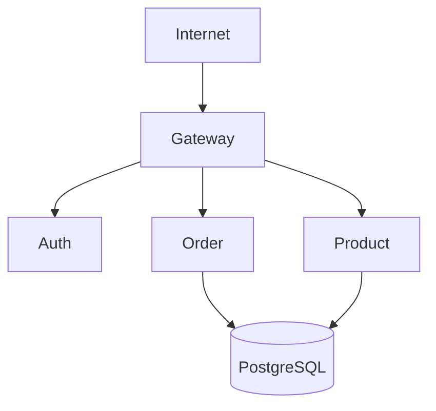

# Roteiro 3 — Order API

## Desenvolvedor

- Esther Cunha  


---

## Descrição da Atividade

Implementação de um **microserviço Order** responsável por cadastrar pedidos contendo _N_ itens e expor operações RESTful para consulta.

Requisitos atendidos:

- **`POST /order`**: criar um pedido completo (cabeçalho + itens).
- **`GET /order`**: listar todos os pedidos.
- **`GET /order/{id}`**: buscar um pedido por ID, validando se pertence à conta informada.
- Persistência em **PostgreSQL** com relacionamento **1 Order ↔ N OrderItem**.
- Geração de UUID automática.
- **Spring Cloud OpenFeign** para validação de produtos no microserviço _Product_.

---

## Endpoints Implementados

### POST `/order`

Cria um pedido com múltiplos itens.  
Se algum `idProduct` não existir no microserviço Product, retorna **`400 Bad Request`**.

**Request body**:

```jsonc
{
  "idAccount": "uuid-account",
  "items": [
    { "idProduct": "uuid-tomato", "quantity": 3 },
    { "idProduct": "uuid-cheese", "quantity": 1 }
  ]
}
```

**Response** `201 Created`:

```json
{
  "id": "generated-uuid",
  "date": "2025-05-23",
  "total": 40.58,
  "account": { "id": "uuid-account" },
  "items": [
    {
      "id": "generated-uuid-item1",
      "product": { "id": "uuid-tomato" },
      "quantity": 3,
      "total": 30.36
    },
    {
      "id": "generated-uuid-item2",
      "product": { "id": "uuid-cheese" },
      "quantity": 1,
      "total": 10.22
    }
  ]
}
```

---

### GET `/order`

Retorna todos os pedidos.

```json
[
  {
    "id": "uuid-order‑1",
    "date": "2025-05-22",
    "total": 12.50,
    "account": { "id": "uuid-account" },
    "items": [/* … */]
  },
  { "id": "uuid-order‑2", "date": "2025-05-23", ... }
]
```
 `200 OK`

---

### GET `/order/{id}?idAccount={idAccount}`

Busca um pedido por ID **e** verifica se pertence à conta.  
Se a combinação não existir, retorna **`404 Not Found`**.

---

## Bottlenecks / Destaques

| ✅ | Implementação |
|----|---------------|
| ✔️ | Relacionamento **1 → N** mapeado com `@OneToMany` / `@ManyToOne`. |
| ✔️ | Persistência em transação única: cabeçalho salvo, itens salvos em _cascade_. |
| ✔️ | Validação de produto via Feign no microserviço _Product_. |
| ✔️ | Migration Flyway garante criação dos esquemas/tabelas e FK antes do start. |
| ✔️ | Geração automática de UUID (`GenerationType.UUID` + `uuid_generate_v4()` no Postgres). |

---

## Estrutura do Projeto

- `Order.java` → objeto de domínio (DTO).
- `OrderItem.java` → objeto de domínio.
- `OrderModel.java` → entidade JPA (`orders.orders`).
- `OrderItemModel.java` → entidade JPA (`orders.order_item`).
- `OrderRepository.java`, `OrderItemRepository.java` → repositórios Spring Data.
- `OrderService.java` → regras de negócio, orquestra validações e persistência.
- `OrderParser.java` → conversão Modelo ⇆ Domínio ⇆ DTO.
- `OrderResource.java` → camada REST (interface `OrderController`).

---

## Base de Dados

Script Flyway utilizado (`orders` é o _schema_ default):

```sql
CREATE SCHEMA IF NOT EXISTS orders;
CREATE EXTENSION IF NOT EXISTS "uuid-ossp";

CREATE TABLE IF NOT EXISTS orders.orders (
    id_order      VARCHAR(36) PRIMARY KEY DEFAULT uuid_generate_v4(),
    id_account    VARCHAR(36) NOT NULL,
    dt_date       DATE NOT NULL,
    db_total      DECIMAL(10,2) NOT NULL
);

CREATE TABLE IF NOT EXISTS orders.order_item (
    id_order_item VARCHAR(36) PRIMARY KEY DEFAULT uuid_generate_v4(),
    id_order      VARCHAR(36) NOT NULL REFERENCES orders.orders(id_order) ON DELETE CASCADE,
    id_product    VARCHAR(36) NOT NULL,
    int_quantity  INTEGER NOT NULL,
    nr_price_product DECIMAL(10,2) NOT NULL,
    nr_total      DECIMAL(10,2) NOT NULL
);

CREATE INDEX IF NOT EXISTS idx_order_item__id_order ON orders.order_item(id_order);
```

---

## Diagrama — Arquitetura da Solução



---

## Testes Realizados

- Testes manuais via **Postman** em todos os endpoints (`201/200/404/400`).  
- Teste de integração salvando pedido com 3 itens e conferindo persistência.  
- Teste de falha: produto inexistente → retorna `400 Bad Request`.  

---


## Repositório

- [https://github.com/Platform-Microservices/order](https://github.com/Platform-Microservices/order)
- [https://github.com/Platform-Microservices/order-service](https://github.com/Platform-Microservices/order-service)

---
