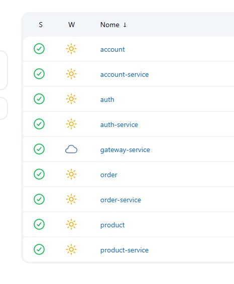

# Roteiro 5 — Deploy com Kubernetes

## Desenvolvedora

- Esther Cunha

---

## ✅ Por que usar Kubernetes?

O **Kubernetes** é uma plataforma de orquestração de containers que automatiza o deployment, escalonamento e gerenciamento de aplicações containerizadas. Ele permite que microserviços sejam executados de forma padronizada, resiliente e escalável.

Utilizar Kubernetes é uma prática essencial em ambientes modernos de produção, pois:

- Garante alta disponibilidade das aplicações.
- Facilita o gerenciamento e monitoramento dos serviços.
- Permite automação de deploys e rollback.
- Suporta diferentes ambientes (local com Minikube, ou em nuvem: AWS EKS, GCP GKE, Azure AKS).

---

## Descrição da Atividade

Foi realizado o deploy dos microserviços em um cluster Kubernetes local utilizando **Minikube**. Todos os microserviços foram publicados no **mesmo cluster**, com seus respectivos arquivos de configuração.

Cada microserviço possui seu próprio diretório de configuração `k8s/` com o arquivo `k8s.yaml`, contendo os seguintes recursos:

- `Secret`
- `ConfigMap`
- `Deployment`
- `Service`

### Microserviços configurados:

- `account-service`
- `auth-service`
- `gateway-service`
- `product-service`
- `order-service`

---

## ✅ Estrutura de Diretórios

```bash
📁 api/
├── 📁 account-service/
│   └── 📁 k8s/
│       └── 📄 k8s.yaml
├── 📁 auth-service/
│   └── 📁 k8s/
│       └── 📄 k8s.yaml
├── 📁 gateway-service/
│   └── 📁 k8s/
│       └── 📄 k8s.yaml
├── 📁 product-service/
│   └── 📁 k8s/
│       └── 📄 k8s.yaml
└── 📁 order-service/
    └── 📁 k8s/
        └── 📄 k8s.yaml
```

---

## ✅ Exemplo de Arquivo `k8s.yaml`

```yaml
apiVersion: apps/v1
kind: Deployment
metadata:
  name: product
spec:
  replicas: 1
  selector:
    matchLabels:
      app: product
  template:
    metadata:
      labels:
        app: product
    spec:
      containers:
        - name: product
          image: 'esthercaroline/product:latest'
          imagePullPolicy: IfNotPresent
          ports:
            - containerPort: 8080
          env:
            - name: DATABASE_HOST
              valueFrom:
                configMapKeyRef:
                  name: postgres-configmap
                  key: POSTGRES_HOST
            - name: DATABASE_USER
              valueFrom:
                secretKeyRef:
                  name: postgres-secrets
                  key: POSTGRES_USER
            - name: DATABASE_PASSWORD
              valueFrom:
                secretKeyRef:
                  name: postgres-secrets
                  key: POSTGRES_PASSWORD

---

apiVersion: v1
kind: Service
metadata:
  name: product
  labels:
    app: product
spec:
  type: ClusterIP
  ports:
    - port: 8080
  selector:
    app: product
```

---

## Verificando os serviços rodando

Após aplicar os manifests com `kubectl apply -f k8s.yaml`, foi utilizado o comando:

```bash
kubectl get pods
kubectl get services
```

Esses comandos confirmam que os serviços estão rodando no mesmo cluster.

---

## Kubernetes rodando

**Exemplo:**  


---

## Conclusão

Com o Kubernetes configurado corretamente, todos os microserviços funcionam de forma isolada, escalável e resiliente. A separação por `Deployment`, `Service`, `Secrets` e `ConfigMap` garante clareza e manutenibilidade, além de facilitar o deploy tanto em ambiente local quanto em nuvem.

---