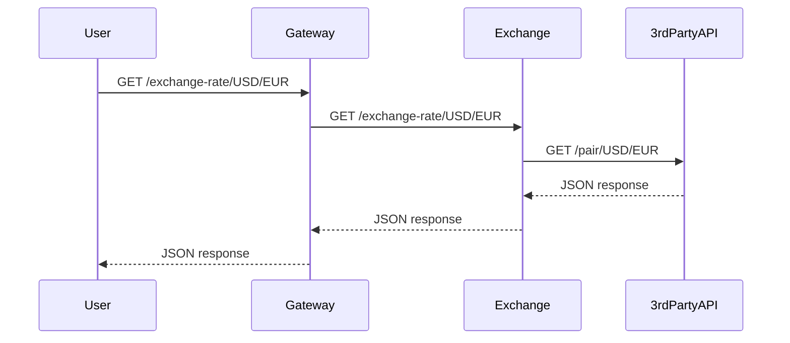

# Roteiro 1 - Exchange

## Data de Entrega: 23/02/2025

## Descrição

Implementamos um microserviço `exchange-service` usando **FastAPI** que permite realizar conversão de moedas via API pública **ExchangeRate-API**.

O serviço responde ao endpoint:

```http
GET /exchange-rate/{from_curr}/{to_curr}
```

Exemplo de uso:

```http
GET /exchange-rate/USD/EUR
```

Resposta esperada:

```json
{
  "result": "success",
  "documentation": "https://www.exchangerate-api.com/docs",
  "terms_of_use": "https://www.exchangerate-api.com/terms",
  "time_last_update_unix": 1619222402,
  "time_last_update_utc": "Sat, 24 Apr 2021 00:00:02 +0000",
  "time_next_update_unix": 1619308802,
  "time_next_update_utc": "Sun, 25 Apr 2021 00:00:02 +0000",
  "base_code": "USD",
  "target_code": "EUR",
  "conversion_rate": 0.82
}
```

---

## Tecnologias usadas

- Python 3.12
- FastAPI
- Uvicorn
- httpx
- Docker
- ExchangeRate-API

---

## O que foi feito

- [x] Implementação do `exchange-service` com FastAPI.
- [x] Integração com ExchangeRate-API utilizando a biblioteca `httpx` de forma assíncrona.
- [x] Resposta retornada diretamente da API de terceiros.
- [x] Configuração para rodar via Docker.
- [x] Testes manuais através do Swagger UI (`/docs`).

---

## Código Fonte

```python
from fastapi import FastAPI, HTTPException
import httpx

app = FastAPI()

@app.get("/exchange-rate/{from_curr}/{to_curr}")
async def get_exchange_rate(from_curr: str, to_curr: str):
    url = f"https://v6.exchangerate-api.com/v6/76bbd4fd2f0355465749613c/pair/{from_curr}/{to_curr}"
    async with httpx.AsyncClient() as client:
        response = await client.get(url)
    
    if response.status_code != 200:
        raise HTTPException(status_code=500, detail="Failed to fetch exchange rate")
    
    return response.json()
```

---

## Diagrama de Sequência



---

## Como rodar o serviço localmente

1. Instalar as dependências:

```bash
pip install fastapi uvicorn httpx
```

2. Rodar o serviço:

```bash
uvicorn main:app --reload
```

3. Testar no navegador ou via `curl`:

```bash
curl http://127.0.0.1:8000/exchange-rate/USD/EUR
```

4. Acessar documentação automática do Swagger:  
http://127.0.0.1:8000/docs

---

## Como rodar com Docker

1. Criar `Dockerfile` (se ainda não tiver):

```dockerfile
FROM python:3.12-slim

WORKDIR /app

COPY . .

RUN pip install fastapi uvicorn httpx

CMD ["uvicorn", "main:app", "--host", "0.0.0.0", "--port", "80"]
```

2. Build e run:

```bash
docker build -t exchange-service .
docker run -p 8000:80 exchange-service
```

Acesse:  
http://localhost:8000/exchange-rate/USD/EUR

---

## Vídeo de apresentação

[Link para o vídeo (2-3 min)](https://youtu.be/seu-video)

---

## ✅ Repositório

- [Link do repositório do GitHub com o código-fonte e documentação]

---