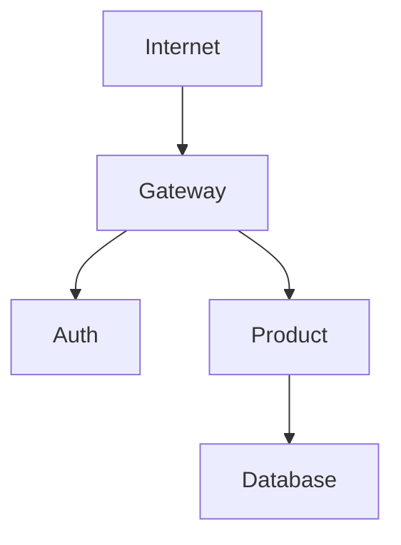

# Roteiro 2 — Product API

## Grupo K

- Esther Cunha  
- [Colocar outros nomes do grupo, se houver]

---

## ✅ Descrição da Atividade

Implementação de um **microserviço Product** com as seguintes operações RESTful:

- `POST /product`: Criar um novo produto.
- `GET /product`: Listar todos os produtos.
- `GET /product/{id}`: Buscar produto por ID.
- `DELETE /product/{id}`: Remover produto por ID.

O serviço foi implementado em **Java** utilizando:

- **Spring Boot**  
- **Spring Data JPA**  
- **Spring Cloud OpenFeign** para comunicação.  
- Banco de dados: **PostgreSQL**.

---

## ✅ Endpoints Implementados

### ➡️ POST `/product`

**Request body:**

```json
{
  "name": "Tomato",
  "price": 10.12,
  "unit": "kg"
}
```

**Response:**

```json
{
  "id": "generated-uuid",
  "name": "Tomato",
  "price": 10.12,
  "unit": "kg"
}
```

✅ Retorna `201 Created` ou `200 OK`.

---

### ➡️ GET `/product`

**Response:**

```json
[
  {
    "id": "uuid1",
    "name": "Tomato",
    "price": 10.12,
    "unit": "kg"
  },
  {
    "id": "uuid2",
    "name": "Cheese",
    "price": 0.62,
    "unit": "slice"
  }
]
```

✅ Retorna `200 OK`.

---

### ➡️ GET `/product/{id}`

**Response:**

```json
{
  "id": "uuid1",
  "name": "Tomato",
  "price": 10.12,
  "unit": "kg"
}
```

✅ Retorna `200 OK`.

---

### ➡️ DELETE `/product/{id}`

✅ Retorna `204 No Content` ao remover com sucesso.

---

## ✅ Bottlenecks Implementados

- ✅ Implementação de validação para evitar `StaleObjectStateException` ao salvar ou deletar produtos.
- ✅ Uso de `@GeneratedValue` para geração automática de UUID.
- ✅ Configuração de Spring Data JPA para operações `CRUD` simplificadas.

---

## ✅ Estrutura do Projeto

- `Product.java` → entidade de domínio.
- `ProductModel.java` → entidade de persistência JPA.
- `ProductRepository.java` → interface de repositório.
- `ProductService.java` → camada de serviço.
- `ProductResource.java` → camada de controller REST.

---

## ✅ Base de Dados

Tabela criada no PostgreSQL com o seguinte script:

```sql
CREATE TABLE product (
    id_product UUID PRIMARY KEY DEFAULT gen_random_uuid(),
    tx_name VARCHAR(256) NOT NULL,
    nu_price NUMERIC(10,2) NOT NULL,
    tx_unit VARCHAR(50) NOT NULL
);
```

---

## ✅ Diagrama — Arquitetura da Solução



---

## ✅ Testes Realizados

- ✅ Testes via Postman de todos os endpoints.  
- ✅ Teste de integração com o Gateway e validação JWT via Auth Service.  

---


## ✅ Vídeo de Apresentação

[Link do vídeo demonstrando a execução e explicação do projeto]

---

## ✅ Repositório

- [Link do repositório do GitHub com o código-fonte e documentação]

---
